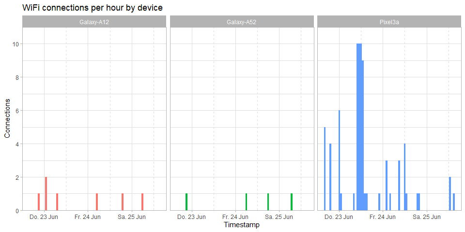
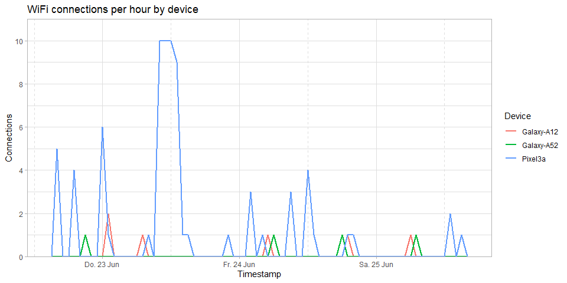

<!-- README.md is generated from README.Rmd. Please edit that file -->

# fritzlog

<!-- badges: start -->
<!-- badges: end -->

`fritzlog` is a package to analyse device login activity for a FritzBox
WiFi router. It can:

-   Load a log file and transform into a well-formatted tibble with
    `fritz_log()`
-   Load a log file and create a graphical summary of device login
    activity with `fritz_plot()`

## Installation

You can install the development version of fritzlog from
[GitHub](https://github.com/) with:

``` r
# install.packages("devtools")
devtools::install_github("nbostelmann/fritzlog")
```

## How to create a log file

Go to the [FritzBox admin page](http://fritz.box/). In the main menu
select `System > Ereignisse > WLAN > Druckansicht` and copy & paste the
output to a text file.

An example file is included with this package.

``` r
file <- system.file("extdata", "fritz.log", package = "fritzlog", mustWork = TRUE)

readr::read_lines(file, n_max = 15)
#>  [1] "25.06.22"                                                                                                                                                                
#>  [2] "14:53:09"                                                                                                                                                                
#>  [3] "WLAN-Gerät hat sich neu angemeldet (5 GHz), 866 Mbit/s, Pixel3a, IP 192.168.178.28, MAC XX:XX:XX:XX:XX:XX."                                                              
#>  [4] "25.06.22"                                                                                                                                                                
#>  [5] "12:50:13"                                                                                                                                                                
#>  [6] "WLAN-Gerät hat sich neu angemeldet (2,4 GHz), 144 Mbit/s, Pixel3a, IP 192.168.178.28, MAC XX:XX:XX:XX:XX:XX."                                                            
#>  [7] "25.06.22"                                                                                                                                                                
#>  [8] "12:46:57"                                                                                                                                                                
#>  [9] "WLAN-Gerät hat sich neu angemeldet (5 GHz), 866 Mbit/s, Pixel3a, IP 192.168.178.28, MAC XX:XX:XX:XX:XX:XX."                                                              
#> [10] "25.06.22"                                                                                                                                                                
#> [11] "12:46:53"                                                                                                                                                                
#> [12] "WLAN-Autokanal: Die Kanaleinstellungen (vorher Kanal 6 (2,4 GHz)) wurden geändert, aktiv auf Kanal 11 (2,4 GHz)."                                                        
#> [13] "25.06.22"                                                                                                                                                                
#> [14] "12:46:51"                                                                                                                                                                
#> [15] "WLAN-Autokanal: Aktuelle Erfassung der WLAN-Umgebung (2,4 GHz) zur Optimierung der genutzten WLAN Kanäle läuft, WLAN-Geräte werden daher unter Umständen neu angemeldet."
```

## fritz_log()

Simply call `fritz_log()` with the path to the log file to get a
well-formatted tibble of device login activity which can be used for
further analysis. The function has no other parameters.

``` r
library(fritzlog)

fritz_log(file)
#> # A tibble: 87 × 3
#>    Timestamp           Device     Message                                       
#>    <dttm>              <chr>      <chr>                                         
#>  1 2022-06-25 14:53:09 Pixel3a    WLAN-Gerät hat sich neu angemeldet (5 GHz), 8…
#>  2 2022-06-25 12:50:13 Pixel3a    WLAN-Gerät hat sich neu angemeldet (2,4 GHz),…
#>  3 2022-06-25 12:46:57 Pixel3a    WLAN-Gerät hat sich neu angemeldet (5 GHz), 8…
#>  4 2022-06-25 06:37:55 Galaxy-A52 WLAN-Gerät hat sich neu angemeldet (2,4 GHz),…
#>  5 2022-06-25 05:53:07 Galaxy-A12 WLAN-Gerät angemeldet (2,4 GHz), 72 Mbit/s, G…
#>  6 2022-06-24 19:30:05 Pixel3a    WLAN-Gerät angemeldet (2,4 GHz), 144 Mbit/s, …
#>  7 2022-06-24 19:25:09 Pixel3a    WLAN-Gerät hat sich neu angemeldet (2,4 GHz),…
#>  8 2022-06-24 18:31:27 Galaxy-A12 WLAN-Gerät angemeldet (2,4 GHz), 72 Mbit/s, G…
#>  9 2022-06-24 18:28:53 Galaxy-A52 WLAN-Gerät angemeldet (5 GHz), 433 Mbit/s, Ga…
#> 10 2022-06-24 12:33:15 Pixel3a    WLAN-Gerät hat sich neu angemeldet (5 GHz), 8…
#> # … with 77 more rows
```

## fritz_plot()

`fritz_plot()` can summarise device login activity in a histogram or a
frequency polygon plot in `ggplot2` format. It takes the path to the log
file and the plot type as parameters.

### Histogram

Call `fritz_plot()` with `plot_type = "histogram"`.

``` r
fritz_plot(file, plot_type = "histogram")
```



### Frequency polygon

Call `fritz_plot()` with `plot_type = "freqpoly"`.

``` r
fritz_plot(file, plot_type = "freqpoly")
```



### Both in one

Plots can be easily combined, for example with the `patchwork` package.

``` r
library(patchwork)

fritz_plot(file, plot_type = "histogram") /
  fritz_plot(file, plot_type = "freqpoly")
```


